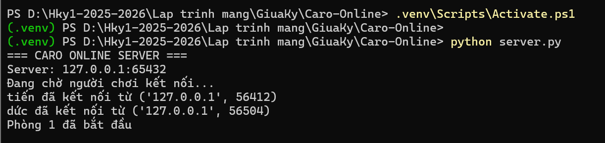
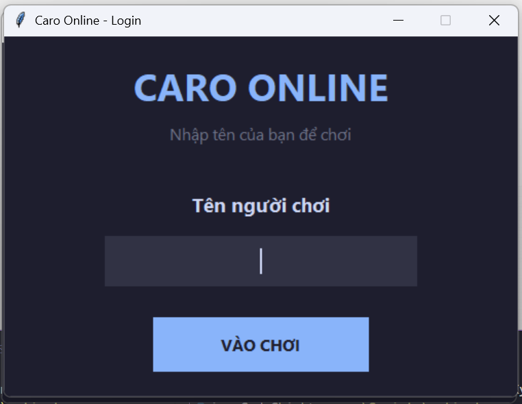
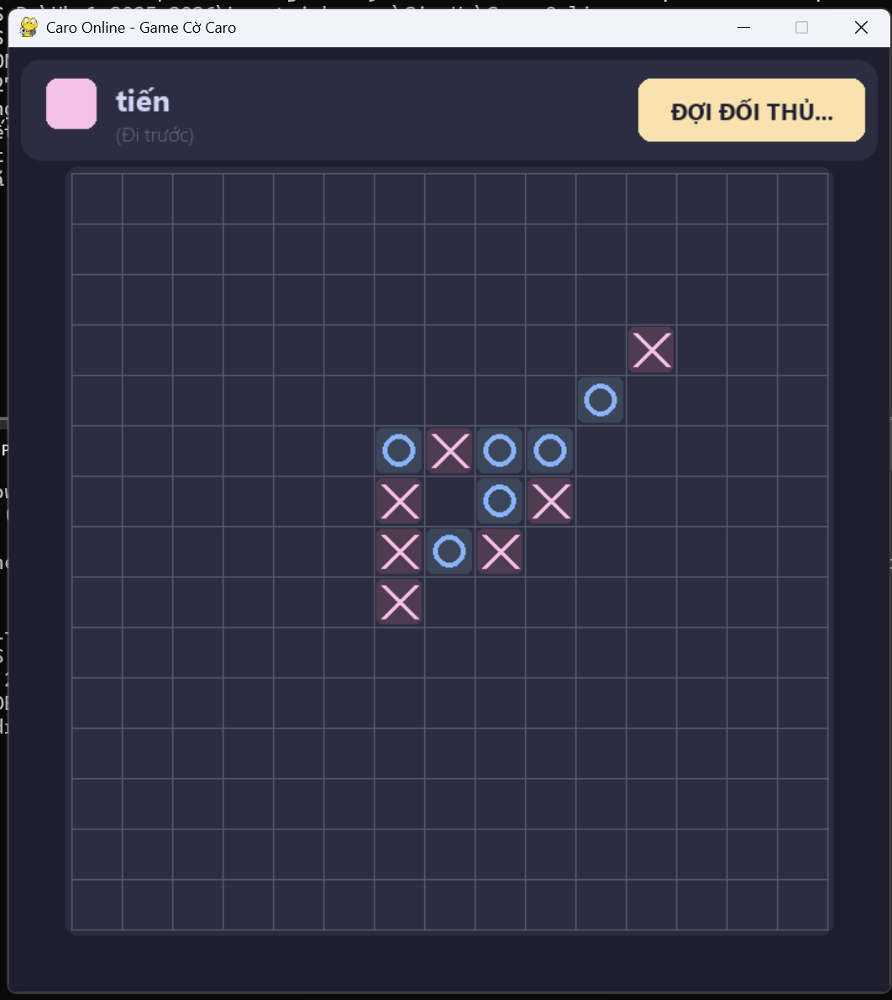
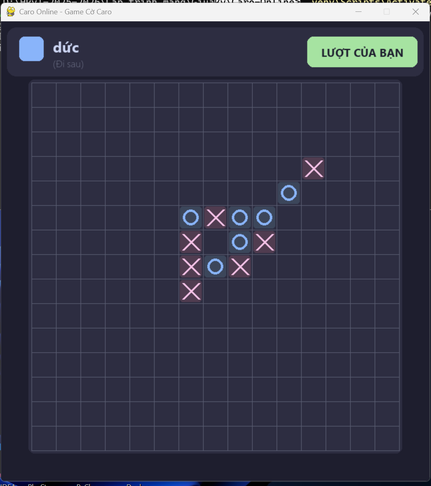

# 🎮 Caro Online

Game cờ Caro trực tuyến cho 2 người chơi qua mạng LAN.

## 📝 Giới thiệu

Caro (Gomoku) là trò chơi dân gian quen thuộc với mọi người, đặc biệt là học sinh sinh viên. Trò chơi có nguồn gốc từ Nhật Bản với tên gọi Gomoku.

**Luật chơi:** Người chơi nào có **5 quân liên tiếp** theo hàng ngang, dọc hoặc chéo sẽ chiến thắng.

## ✨ Tính năng

- 🎨 Giao diện hiện đại, tối màu (Dark theme)
- 🇻🇳 Hỗ trợ tiếng Việt hoàn toàn
- 🔄 Chức năng chơi lại sau khi kết thúc ván
- 🔀 Tự động đổi quân X/O khi chơi lại
- 👥 Hiển thị vai trò "Đi trước" / "Đi sau"
- 📡 Kết nối qua mạng LAN (TCP/IP)

## 🛠️ Yêu cầu hệ thống

- Python 3.10+
- pygame-ce >= 2.5.6

## 📦 Cài đặt

```bash
# Tạo môi trường ảo
python -m venv .venv

# Kích hoạt môi trường ảo
# Windows:
.venv\Scripts\activate

# Cài đặt thư viện
pip install -r requirements.txt
```

## 🚀 Cách chạy game

### Cách 1: Chạy thủ công

> ⚠️ **Quan trọng:** Mỗi lệnh chạy trong một cửa sổ Terminal riêng biệt!

**Terminal 1 - Chạy Server:**

```powershell
# Mở Terminal, di chuyển đến thư mục project
cd "đường-dẫn-đến-thư-mục/Caro-Online"

# Kích hoạt môi trường ảo
.venv\Scripts\Activate.ps1      # PowerShell
# hoặc
.venv\Scripts\activate.bat      # CMD

# Chạy Server
python server.py
```

**Terminal 2 - Người chơi 1:**

```powershell
# Mở Terminal MỚI, di chuyển đến thư mục project
cd "đường-dẫn-đến-thư-mục/Caro-Online"

# Kích hoạt môi trường ảo
.venv\Scripts\Activate.ps1      # PowerShell
# hoặc
.venv\Scripts\activate.bat      # CMD

# Chạy game
python game.py
```

**Terminal 3 - Người chơi 2:**

```powershell
# Mở Terminal MỚI, di chuyển đến thư mục project
cd "đường-dẫn-đến-thư-mục/Caro-Online"

# Kích hoạt môi trường ảo
.venv\Scripts\Activate.ps1      # PowerShell
# hoặc
.venv\Scripts\activate.bat      # CMD

# Chạy game
python game.py
```

### Cách 2: Chạy tự động (Khuyến nghị)

Double-click file `run_game.bat` để khởi động cả Server và 2 Client tự động.

> 💡 **Mẹo:** Nếu dùng VS Code, có thể mở 3 Terminal bằng cách click nút **+** ở góc Terminal.

## 📁 Cấu trúc project

```
Caro-Online/
├── server.py       # Server quản lý kết nối và phòng chơi
├── game.py         # Client game với giao diện Pygame
├── menu.py         # Cửa sổ đăng nhập
├── username.py     # Form nhập tên người chơi
├── Won.py          # Thuật toán kiểm tra thắng
├── requirements.txt
├── run_game.bat    # Script khởi động nhanh
└── README.md
```

## 🎮 Hướng dẫn chơi

1. Nhập tên của bạn tại màn hình đăng nhập
2. Chờ đối thủ kết nối vào phòng
3. Người chơi cầm quân **X** sẽ đi trước
4. Click vào ô trống để đặt quân
5. Ai có 5 quân liên tiếp trước sẽ thắng
6. Sau khi kết thúc, có thể chọn **Chơi lại** hoặc **Thoát**

## 📸 Ảnh minh họa

### Server



### Menu Game



### Người chơi 1



### Người chơi 2



## 👨‍💻 Tác giả

Bài tập giữa kỳ môn **Lập trình mạng** - HK1 2025-2026

1. Nguyễn Hữu Nghĩa
2. Hồ Trọng Bảo
3. Nguyễn Tiến Đức
4. Đặng Minh Quân
5. Huỳnh Duy Thiện

## ❗ Lỗi thường gặp và cách khắc phục

### 1. Lỗi thiếu thư viện pygame

```
ModuleNotFoundError: No module named 'pygame'
```

**Cách khắc phục:**

```bash
pip install pygame-ce
```

> ⚠️ **Lưu ý:** Dùng `pygame-ce` (Community Edition) thay vì `pygame` vì pygame gốc chưa hỗ trợ Python 3.13+

---

### 2. Lỗi phiên bản Python quá cũ

```
SyntaxError: f-string expression part cannot include a backslash
```

**Cách khắc phục:** Nâng cấp Python lên phiên bản 3.10 trở lên

- Tải tại: https://www.python.org/downloads/

---

### 3. Lỗi không kết nối được Server

```
ConnectionRefusedError: [WinError 10061] No connection could be made...
```

**Nguyên nhân:** Server chưa được khởi động

**Cách khắc phục:** Chạy `python server.py` trước khi chạy `python game.py`

---

### 4. Lỗi cổng đã được sử dụng

```
OSError: [WinError 10048] Only one usage of each socket address...
```

**Nguyên nhân:** Server đang chạy ở cổng 65432

**Cách khắc phục:**

- Đóng terminal cũ đang chạy server
- Hoặc đổi cổng trong file `server.py` và `game.py`

---

### 5. Lỗi font chữ tiếng Việt bị lỗi

```
Chữ tiếng Việt hiển thị ô vuông hoặc ký tự lạ
```

**Cách khắc phục:** Cài font **Segoe UI** (có sẵn trên Windows) hoặc sửa font trong `game.py`:

```python
title_font = pygame.font.SysFont("Arial", 24, bold=True)
```

---

### 6. Lỗi SSL Certificate (khi cài thư viện)

```
SSL: CERTIFICATE_VERIFY_FAILED
```

**Cách khắc phục:**

```bash
pip install --trusted-host pypi.org --trusted-host files.pythonhosted.org pygame-ce
```

---

### 7. Lỗi môi trường ảo không kích hoạt

**Windows PowerShell:**

```powershell
# Nếu gặp lỗi "cannot be loaded because running scripts is disabled"
Set-ExecutionPolicy -ExecutionPolicy RemoteSigned -Scope CurrentUser

# Sau đó kích hoạt lại
.venv\Scripts\Activate.ps1
```

**Windows CMD:**

```cmd
.venv\Scripts\activate.bat
```

---

### 8. Game đứng yên, không phản hồi

**Nguyên nhân:** Đối thủ đã thoát hoặc mất kết nối

**Cách khắc phục:** Đóng game và khởi động lại từ đầu
